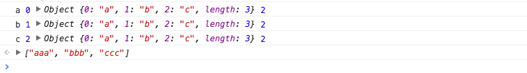

JavaScript数组所有API全解密
=========================

数组是一种非常重要的数据类型，它语法简单、灵活、高效。在多数编程语言中，数组都充当着至关重要的角色，以至于很难想象没有数组的编程语言会是什么模样。特别是javascript，它天生灵活，有进一步发挥了数组的特长，丰富了数组的使用场景。可以好不夸张地说，不深入地了解数组，不足以写javascript。

截止ES7规范，数组共包含33个标砖的API方法和一个费标砖的API方法，使用场景和使用方案纷繁复杂，其中有不少浅坑，神坑甚至神坑。下面将从Array构造器及ES6新特性开始，逐步帮助你掌握数组。

声明：一下未特别声明的方法均为ES5以实现方法。

## Array构造器

Array构造器用于构建一个新的数组。通常，我们推荐使用字面量创建数组，这是一个好习惯，但是总有对象字面量乏力的时候，比如说，我想创建一个长度为8的空数组。请比较如下两种方式：

```js

// 使用Array构造器
var a = Array(8); //[undefined * 8]
// 使用对象字面量
var b = [];
b.length = 8; // [undefined * 8]

```

Array构造器明显要简洁一些，当然你也许会说，对象字面量也不错，那我保持沉默。

如上，我是用`Array(8)`而不是`new Array(8)`，这会影响吗？实际上，并没有影响，这得益于Array构造器内部对this指针的判断，[ELS5_HTML规范](http://ecma262-5.com/ELS5_HTML.htm#Section_15.4.1)是这么说的：

```

When Array is called as a function rather than as a constructor, it creates and initialises a new Array object. Thus the function call Array(…) is equivalent to the object creation expression new Array(…) with the same arguments.

```

从规范来看，浏览器内部大致做了如下类似的实现：

```js

function Array() {
	// 如果this不是Array的实例，那就重新new一个实例
	if(!(this instanceof arguments.callee)) {
		return new arguments.calee();
	}
}

```

关于Array构造器语法的介绍：

Array构造器根据参数长度不同，有如下两种不同的处理：

*	new Array(arg1, arg2...),参数长度为0或长度等于2时，传入参数将按照顺序依次称为新数组的地0至N项（参数长度为0时，返回空数组）
*	new Array(len)，当len不是数值时，处理同上，返回一个只包含len元素一项的数组；当len为数值时，根据如下规范，len最大不能超过32位无符号整型，即需要小于2的32次方（len最大为`Math.pow(2,32) -1 或 -1>>>0`），否则将抛出RangeError

```

If the argument len is a Number and ToUint32(len) is equal to len, then the length property of the newly constructed object is set to ToUint32(len). If the argument len is a Number and ToUint32(len) is not equal to len, a RangeError exception is thrown.

```

以上，请注意Array构造器对于单个数值参数的特殊处理，如果仅仅需要使用数组包裹若干参数，不放使用Array.of，具体请看下一节。

## ES6新增的构造函数方法

剑雨数组的常用性，ES6专门扩展了数组构造器`Array`，新增2个方法：`Array.of`、`Array.from`。

### Array.of

Array.of用于将参数一次转化为数组中的一项，然后返回这个新数组，而不管这个参数是数字还是其他。它基本上与Array构造器功能一致，唯一的区别就在单个数字参数的处理上。如下：

```js

Array.of(8.0); //[8]
Array(8.0); // [undefined * 8]

```

参数为多个，或单个参数不是数字时，Array.of与Array构造器等同

```js

Array.of(8.0, 5); // [8]
Array(8.0, 5); // [8, 5]
Array.of('8'); // ['8']
Array('8'); //['8']

```

因此，若是需要使用数组包裹元素，推荐优先使用Array.of方法

目前，以下版本的浏览器提供对Array.of的支持

<table>
	<tr>
		<td>Chrome</td>
		<td>Firefox</td>
		<td>Edge</td>
		<td>Safari</td>
	</tr>
	<tr>
		<td>45+</td>
		<td>25+</td>
		<td>✔️</td>
		<td>9.0+</td>
	</tr>
</table>

计时其他版本浏览器不支持也不必担心，由于Array.of与Array构造器的这种高度相似性，实现一个polyfill十分简单。如下：

```js

if (!Array.of){
	Array.of = function(){
		return Array.prototype.slice.call(arguments);
	}
}

```

### Array.from

语法：Array.from(arrayLike[, processingFn[, thisArg]])

Array.from的设计初衷是快速便捷的基于其他对象创建新数组，准确来说就是从一个类似数组的可迭代对象创建一个新的数组实例，通俗一点，只要一个对象有迭代器，Array.from就能把它变成一个数组（当然，是返回新的数组，不改变原对象）。

从语法上看，Array.form拥有三个形参，第一个为类似数组的对象，必选。第二个为加工函数，新生成的数组会经过该函数的加工再返回。第三个为this作用于，表示加工函数执行时this的值。后两个参数都是可选的。我们来看看用法。

```js

var obj = {0: 'a', 1: 'b', 2: 'c', length: 3};
Array.from(obj, function(value, index){
	console.log(value, index, this, arguments.length);
	return value.repeat(3); // 必须制定返回值，否则返回undefined
}, obj);

```

执行结果如下：



可以看到加工函数的this作用域被obj对象取代，也可以看到加工函数默认拥有两个形参，分别为迭代当前元素的值和其索引。

注意，一旦使用加工函数，必须明确指定返回值，否则将饮食返回undefined，最终生成的数组编程一个只包含若干个undefined元素的空数组。

实际上，如果不需要指定this，加工函数完全可以是一个箭头函数，上述代码可以简化如下：

```js

Array.from(obj, (value) => value.repeat(3));

```

除了上述obj对象外，拥有迭代器的对象还包括这些：`String`、`Set`、`Map`、`arguments`等。

Array.from统统可以处理，如下所示：

```js

// String
Array.from('abc'); // ['a', 'b', 'c']
// Set
Array.from(new Set(['abc', 'def']));
// Map
Array.from(new Map([[1, 'abc'], [2, 'def']]));
// 提升讷航的类数组对象arguments
function fn(){
	return Array.from(arguments)
}
fn(1, 2, 3); //[1, 2, 3]

```

到这里你可能以为Array.from就讲完了，实际上还有一个重要的扩展场景必须提一下。比如说生成一个从0到指定数字的新数组，Array.from就可以轻易做到。

```js

Array.from({lentgh: 10}, (v, i) => i); // [0, 1, 2, 3, 4, 5, 6, 7, 8, 9]

```

后面我们将会看到，利用数组的keys方法实现上述功能，可能还要简单一些。

目前，一下版本浏览器提供了对Array.from的支持

<table>
	<tr>
		<td>Chrome</td>
		<td>Firefox</td>
		<td>Edge</td>
		<td>Opera</td>
		<td>Safari</td>
	</tr>
	<tr>
		<td>45+</td>
		<td>32+</td>
		<td>✔️</td>
		<td>✔️</td>
		<td>9.0+</td>
	</tr>
</table>

## Array.isArray

顾名思义，Array.isArray用来判断一个变量是否是数组类型。JS的弱类型机制导致判断变量类型是初级前端开发者的必考题，一般我都会将其作为考察候选人第一题，然后基于此展开。在ES5提供该方法之前，我们至少有如下2种方式去判断一个值是否是数组：

```js

var a = [];
// 1.基于instanceof
a instanceof Array
// 2.基于constructor
a.constructor === Array
// 3.基于Object.prototype.isPrototypeOf
Array.prototype.idPrototypeOf(a);
// 4.基于getPrototypeOf
Object.getPrototypeOf(a) === Array.prototype;
// 5.基于Object.prototype.toString
Object.prototype.toString.apply(a) === '[object Array]'

```

以上，除了`Object.prototype.toString`外，其他方法都不能正确判断变量的类型。

要知道，代码的运行环境十分复杂，一个变量可能使用浑身解数去迷惑它的创造者，且看：

```js

var a = {
	_proto_: Array.prototype
};
// 分别在控制台试运行以下代码
// 1.基于instanceof
a instanceof Array; // true
// 2.基于constructor
a.constructor === Array; // true
// 3.基于Object.prototype.isPrototypeOf
Array.prototype.isPrototypeOf(a); //true
// 4.基于getPrototypeOf
Object.getPrototypeOf(a) === Array.prototype; // true
 
```

以上，4种方法将会全部返回`true`，为什么呢？我们只是手动指定了某个对象的`_proto_`属性为`Array.prototype`，便导致了该对象继承了Array对象，这种好不负责的继承方式，使得基于继承的判断方案瞬间土崩瓦解。

不仅如此，我们还知道，Array是堆数据，变量指向的只是它的引用地址，因此每个页面的Array对象引用的地址都是一样的。iframe中声明的数组，它的构造函数是iframe中的Array对象。如果在iframe声明了一个数组`X`，将其赋值给父页面的变量`Y`，那么在父页面使用`y instanceof Array`，结果一定是`false`的。而最后一种返回的是字符串，不会存在引用问题。实际上多页面或系统之间的交互只有字符串能够畅行无阻。

相反，使用Array.isArray则非常简单，如下：

```js

Array.isArray([]); // true
Array.isArray({0: 'a', length: 1}); // false

```

目前，一下版本浏览器提供对Array.isArray的支持

<table>
	<tr>
		<td>Chrome</td>
		<td>Firefox</td>
		<td>IE</td>
		<td>Opera</td>
		<td>Safari</td>
	</tr>
	<tr>
		<td>5+</td>
		<td>4+</td>
		<td>9+</td>
		<td>10.5+</td>
		<td>5+</td>
	</tr>
</table>

实际上，通过`Object.prototype.toString`去判断一个值的类型，也是个大主流库的标准。因此Array.isArray的polyfill通常长这样：

```js

if(!Array.isArray){
	Array.isArray = function(arg) {
		return Object.prototype.toString.call(arg) === '[object Array]';
	}
}

```

## 数组推导

ES6对数组的增强不止是体现在api上，还包括语法糖。比如说`for of`，它就是借鉴其他语言而成的语法糖，这种基于原数组使用`for of`生成新数组的语法糖，叫做数组推导。数组推导最初起草在ES6的草案中，但在第27版（2014年8月）中被移除，目前只有firefox v30+支持，推导有风向，使用需谨慎。索性，如今这些语言都还支持推导：CoffeeScript、Python、Haskell、Clojure，我们可以从中一窥端倪。这里我们以python的`for in`推导打个比方：

```

# python for in 推导
a = [1, 2, 3, 4]
print [i * i for i in a if i == 3] # [9]

```

如下是SpiderMonkey引擎（Firefox）之前基于ES4规范实现的数组推导(与python的推导十分相似)：

```
	
[i * i for (i of a)] // [1, 4, 9, 16]

```

ES6中数组有关的for of在ES4的基础上进一步演化，for关键字居首，in在中间，最后才是运算表达式。如下：

```

[for (i of [1, 2, 3, 4]) i * i] // [1, 4, 9, 16]

```

同python的示例，ES6中数组有关的for of也可以使用if语句：

```

// 单个if
[for (i of [1, 2, 3, 4]) if (i == 3) i * i] // [9]
// 甚至是多个if
[for (i of [1, 2, 3, 4]) if (i > 2) if (i < 4) i * i] // [9]

```

更为强大的是，ES6数组推导还允许多重for of。

```

[for (i of [1, 2, 3]) for (j of [10, 100]) i * j] // [10, 100, 20, 200, 30, 300]

```

甚至，数组推导还能够嵌入另一个数组推导中。

```
	
[for (i of [1, 2, 3]) [for (j of [10, 100]) i * j] ] // [[10, 100], [20, 200], [30, 300]]


```

对于上述两个表达式，前者和后者唯一的区别，就在于后者的第二个推导是先返回数组，然后与外部的推导再进行一次运算。

除了多个数组推导嵌套外，ES6的数组推导还会为每次迭代分配一个新的作用域（目前Firefox也没有为每次迭代创建新的作用域）：

```

// ES6规范
[for (x of [0, 1, 2]) () => x][0]() // 0
// Firefox运行
[for (x of [0, 1, 2]) () => x][0]() // 2

```

通过上面的实例，我们看到使用数组推导来创建新数组比forEach，map，filter等遍历方法更加简洁，只是非常可惜，它不是标准规范。

ES6不仅新增了对Array构造器相关API，还新增了8个原型的方法。接下来我会在原型方法的介绍中穿插着ES6相关方法的讲解，请耐心往下读。

## 原型

继承的常识告诉我们，JS中素有的数组方法均来自于Array.prototype，和其他构造函数一样，你可以通过扩展`Array`的`prototype`属性上的方法来给所有数组实例增加方法。

值得一说的是，Array.prototype本身就是一个数组

```js

Array.isArray(Array.prototype) // true
console.log(Array.prototype.length); //0

```

以下方法可以进一步验证：

```js

console.log([]._proto_.length); // 0
console.log([]._proto_); // [Symbol(Symbol.unscopables): Object]

```

有关Symbol(Symbol.unscopables)的知识，这个理不在详述，具体请移步后续章节。

## 方法

数组远行提供的方法非常之多，主要分为三种，一种是会改变自身值的，一种是不会改变自身值的，另外一种就是遍历方法。

由于Array.prototype的某些属性被设置为[[DontEnum]]，天赐不能用一般的方法进行遍历，我们可以通过如下方法获取Array.prototype的所有方法：

```js

Object.getOwnPropertyNames(Array.prototype); // ["length", "constructor", "toString", "toLocaleString", "join", "pop", "push", "reverse", "shift", "unshift", "slice", "splice", "sort", "filter", "forEach", "some", "every", "map", "indexOf", "lastIndexOf", "reduce", "reduceRight", "copyWithin", "find", "findIndex", "fill", "includes", "entries", "keys", "concat"]

```

### 改变自身值的方法（9个）

基于ES6，改变自身值的方法一共有9个，分别是pop、push、reverse、shift、sort、splice、unshift，以及两个ES6新增的方法copyWithin和fill。

对于能改变自身值的数组方法，日常开发中需要特别注意，尽量便在玄幻便利中去改变原数组的项。接下来我们一起来深入了解这些方法。

#### pop

pop()方法删除一个数组中的左后一个元素，并且返回这个元素。如果是栈的话，这个过程就是栈顶弹出。

```js

var array = ["cat", "dog", "cow", "chicken", "mouse"];
var item = array.pop();
console.log(array); // ["cat", "dog", "cow", "chicken"]
console.log(item); // mouse

```

由于设计上的巧妙，pop方法可以应用在类数组对象上，如下：

```js

var o = {0:"cat", 1:"dog", 2:"cow", 3:"chicken", 4:"mouse", length:5}
var item = Array.prototype.pop.call(o);
console.log(o); // Object {0: "cat", 1: "dog", 2: "cow", 3: "chicken", length: 4}
console.log(item); // mouse

```

但如果类数组对象不具有length属性，那么该对象被创建length属性，length属性值为0.如下：

```js

var o = {0:"cat", 1:"dog", 2:"cow", 3:"chicken", 4:"mouse"}
var item = Array.prototype.pop.call(o);
console.log(array); // Object {0: "cat", 1: "dog", 2: "cow", 3: "chicken", 4: "mouse", length: 0}
console.log(item); // undefined

```

#### push

push()方法添加一个或者多个元素到数组末尾，并返回数组新的长度。如果是栈的话，这个过程就是栈顶压入。

语法：arr.push(element1,...,elementN)

```js

var array = ["football", "basketball", "volleyball", "Table tennis", "badminton"];
var i = array.push("golfball");
console.log(array); // ["football", "basketball", "volleyball", "Table tennis", "badminton", "golfball"]
console.log(i); // 6

```

同pop方法一样，push方法也可以应用到类数组对象上，如果length不能被转成一个数值或者不存在length属性，则插入的元素索引为0，且length属性不存在时，将会创建它。

```js

var o = {0: "football", 1: "basketball"};
var i = Array.prototype.push.call(o, "golfball");
console.log(o); // Object {0: "golfball", 1: "basketball", length: 1}
console.log(i); // 1

```

实际上，push方法是根据length属性来决定从哪里开始插入给定值。

```js

var o = {0:"football", 1:"basketball",length:1};
var i = Array.prototype.push.call(o,"golfball");
console.log(o); // Object {0: "football", 1: "golfball", length: 2}
console.log(i); // 2

```

利用push根据length属性插入元素的特点，可以实现数组的合并，如下：

```js

var array = ["football", "basketball"];
var array2 = ["volleyball", "golfball"];
var i = Array.prototype.push.apply(array,array2);
console.log(array); // ["football", "basketball", "volleyball", "golfball"]
console.log(i); // 4

```

#### reverse

reverse()方法颠倒数组中元素的位置，第一个会成为最后一个，最后一个会成为第一个，该方法返回对数组的引用。

语法：arr.reverse()

```js

var array = [1,2,3,4,5];
var array2 = array.reverse();
console.log(array); // [5,4,3,2,1]
console.log(array2 === array) // true

```

同上，reverse也是鸭式辩型的受益者，调到元素的范围受length属性制约。如下：

```js

var o = {0:"a", 1:"b", 2:"c", length:2};
var o2 = Array.prototype.reverse.call(o);
console.log(o); // Object {0: "b", 1: "a", 2: "c", length: 2}
console.log(o === o2); // true

```	

如果length属性小于2或者length属性不为数值，那么原类数组对象将没有变化。及时length属性不存在，该对象也不会去创建length属性。特别的是，当length属性较大时，类数组对象的【索引】会尽可能的项length看齐。如下：

```js

var o = {0:"a", 1:"b", 2:"c",length:100};
var o2 = Array.prototype.reverse.call(o);
console.log(o); // Object {97: "c", 98: "b", 99: "a", length: 100}
console.log(o === o2); // true

```	

#### shift

shift()方法删除数组第一个元素，并返回这个元素。如果是栈的话，这个过程就是栈底弹出。

语法：arr.shift()

```js

var array = [1,2,3,4,5]
var item = array.shift();
console.log(array); // [2,3,4,5]
console.log(item); // 1

```								
同样受益于鸭式辩型，对于类数组对象，shift仍然能够处理。如下：

```js

var o = {0:"a",1:"b",2:"c",length:3};
var item = Array.prototype.shift.call(o);
console.log(o); // Object {0:"b",1:"c",length: 2}
console.log(item); // a

```

如果类数组对象length属性不存在，将添加length属性，并初始化为0.如下：

```js

var o = {0:"a", 1:"b", 2:"c"}
var item = Array.prototype.shift.call(o);
console.log(o); // Object {0:"a", 1:"b", 2: "c", length: 0}
console.log(item); // undefined


```		

#### sort

sort()方法对数组元素进行排序，并返回这个数组。sort方法比较复杂，这里我将多花些篇幅来讲这块。

语法：arr.sort([comparefn])

comparefn是可选的，如果省略，数组将按照各自转换为字符串的Unicode（万国码）位点顺序排序，例如“Boy”将排在“apple”之前。当对数字排序的时候，25将排到8之前，因为转换为字符串后，“25”将比“8”靠前。例如：

```js

var array = ["apple","Boy","Cat","dog"];
var array2 = array.sort();
console.log(array); // ["Boy","Cat","apple","dog"]
console.log(array2 == array); // true

array = [10, 1, 3, 20];
var array3 = array.sort();
console.log(array3); // [1, 10, 20, 3]

```

如果指明了comparefn，数组将按照调用该函数的返回值来排序。若a和b是两个将要比较的元素：

*	若 comparefn(a, b) < 0，那么a 将排到 b 前面；
*	若 comparefn(a, b) = 0，那么a 和 b 相对位置不变；
*	若 comparefn(a, b) > 0，那么a , b 将调换位置；	

如果数组元素为数字，则排序函数comparefn格式如下所示：

```js

function compare(a, b){
	return a-b;
}

```

如果十足元素为非ASCII字符的字符串（如包含类似 e、é、è、a、ä 或中文字符等非英文字符的字符串），则需要使用String.localeCompare。下面这个函数将排到正确的顺序。

```js

var array = ['互','联','网','改','变','世','界'];
var array2 = array.sort();
var array = ['互','联','网','改','变','世','界']; // 重新赋值,避免干扰array2
var array3 = array.sort(function (a, b) {
  return a.localeCompare(b);
});
console.log(array2); // ["世", "互", "变", "改", "界", "网", "联"]
console.log(array3); // ["变", "改", "互", "界", "联", "世", "网"]

```

如上，『互联网改变世界』这个数组，sort函数默认按照数组元素unicode字符串形式进行排序，然而实际上，我们期望的是按照拼音先后顺序进行排序，显然String.localeCompare 帮助我们达到了这个目的。

为什么上面测试中需要重新给array赋值呢，这是因为sort每次排序时改变的是数组本身，并且返回数组引用。如果不这么做，经过连续两次排序后，array2 和 array3 将指向同一个数组，最终影响我们测试。array重新赋值后就断开了对原数组的引用。
	
同上，sort一样受益于鸭式辨型，比如：

```js

var o = {0:'互',1:'联',2:'网',3:'改',4:'变',5:'世',6:'界',length:7};
Array.prototype.sort.call(o,function(a, b){
  return a.localeCompare(b);
});
console.log(o); // Object {0: "变", 1: "改", 2: "互", 3: "界", 4: "联", 5: "世", 6: "网", length: 7}, 可见同上述排序结果一致

```	

注意：使用sort的鸭式辨型特性时，若类数组对象不具有length属性，它并不会进行排序，也不会为其添加length属性。					

```js

var o = {0:'互',1:'联',2:'网',3:'改',4:'变',5:'世',6:'界'};
Array.prototype.sort.call(o,function(a, b){
  return a.localeCompare(b);
});
console.log(o); // Object {0: "互", 1: "联", 2: "网", 3: "改", 4: "变", 5: "世", 6: "界"}, 可见并未添加length属性


```

#### 使用映射改善排序

comparefn如果需要对数组元素多次转换以实现排序，那么使用map辅助排序将是个不错的选择。基本思想就是讲数组的每个元素实际比较的值取出来，排序后将数组恢复。

```js

// 需要被排序的数组
var array = ['dog', 'Cat', 'Boy', 'apple'];
// 对需要排序的数字和位置的临时存储
var mapped = array.map(function(el, i) {
  return { index: i, value: el.toLowerCase() };
})
// 按照多个值排序数组
mapped.sort(function(a, b) {
  return +(a.value > b.value) || +(a.value === b.value) - 1;
});
// 根据索引得到排序的结果
var result = mapped.map(function(el){
  return array[el.index];
});
console.log(result); // ["apple", "Boy", "Cat", "dog"]

```

#### 奇怪的chrome

实际上，ECMAscript规范中并未规定具体的sort算法，这就势必导致各个浏览器不尽相同的sort算法，请看sort方法在Chrome浏览器下的表现：

```js

var array = [{ n: "a", v: 1 }, { n: "b", v: 1 }, { n: "c", v: 1 }, { n: "d", v: 1 }, { n: "e", v: 1 }, { n: "f", v: 1 }, { n: "g", v: 1 }, { n: "h", v: 1 }, { n: "i", v: 1 }, { n: "j", v: 1 }, { n: "k", v: 1 }, ];
array.sort(function (a, b) {
	return a.v - b.v;
});
for (var i = 0,len = array.length; i < len; i++) {
    console.log(array[i].n);
}
// f a c d e b g h i j k

```

由于v值相等，array数组排序前后应该不变，然而Chrome却表现异常，而其他浏览器(如IE 或 Firefox) 表现正常。

```js

var array = [{ n: "a", v: 1 }, { n: "b", v: 1 }, { n: "c", v: 1 }, { n: "d", v: 1 }, { n: "e", v: 1 }, { n: "f", v: 1 }, { n: "g", v: 1 }, { n: "h", v: 1 }, { n: "i", v: 1 }, { n: "j", v: 1 },];
array.sort(function (a, b) {
  return a.v - b.v;
});
for (var i = 0,len = array.length; i < len; i++) {
  console.log(array[i].n);
}
// a b c d e f g h i j

```

从a到j刚好10条数据

那么我么你该如何规避Chrome浏览器的这种“bug”呢？其实很简单，只需略动手脚，改变排序方法的返回值即可，如下：

```js

arr.sort(function (a, b) {
	return a.v - b.v || array.indexOf(a)-array.indexOf(b);
})

```

是数组烦人sort方法需要注意一点各个浏览器针对sort方法内部算法不尽相同，排序函数尽量返回-1,0,1三种不同的值，不要尝试返回true和false等其他数值，天威可能导致不可靠的排序结果。

#### 问题分析

sort方法传入的排序函数如果返回布尔值会导致什么样的结果呢？

一下是常见的浏览器以及脚本引擎：

<table>
	<tr>
		<td>Browser Name</td>
		<td>ECMAScript Engine</td>
	</tr>
	<tr>
		<td>Internet Explorer 6 - 8</td>
		<td>JScript</td>
	</tr>
	<tr>
		<td>Internet Explorer 9 - 10</td>
		<td>Chakra</td>
	</tr>
	<tr>
		<td>Firefox</td>
		<td>SpiderMonkey, IonMonkey, TraceMonkey</td>
	</tr>
	<tr>
		<td>Chrome</td>
		<td>V8</td>
	</tr>
	<tr>
		<td>Safair</td>
		<td>JavaScriptCore(SquirrelFish Extreme)</td>
	</tr>
	<tr>
		<td>Opera</td>
		<td>	Carakan</td>
	</tr>
</table>

分析一下代码，语气将数组元素进行升序排序：

```js

var array = [7,6,5,4,3,2,1,0,8,9];
var comparefn = function (x,y) {
	return x > y;
};
array.sort(comparefn);

```

代码中，comparefn函数返回值为bool类型，并非为规范规定的-1,0,1值。那么执行代码，各JS脚本引擎实现情况如何？

<table>
	<tr>
		<td></td>
		<td>输出结果</td>
		<td>是否符合预期</td>
	</tr>
	<tr>
		<td>JScript</td>
		<td>[2, 3, 5, 1, 4, 6, 7, 0, 8, 9]</td>
		<td>否</td>
	</tr>
	<tr>
		<td>Carakan/td>
		<td>[0, 1, 3, 8, 2, 4, 9, 5, 6, 7]</td>
		<td>否</td>
	</tr>
	<tr>
		<td>Chakra & JavaScriptCore</td>
		<td>[7, 6, 5, 4, 3, 2, 1, 0, 8, 9]</td>
		<td>否</td>
	</tr>
	<tr>
		<td>SpiderMonkey</td>
		<td>[0, 1, 2, 3, 4, 5, 6, 7, 8, 9]</td>
		<td>是</td>
	</tr>
	<tr>
		<td>V8</td>
		<td>[0, 1, 2, 3, 4, 5, 6, 7, 8, 9]</td>
		<td>是</td>
	</tr>
</table>

### 根据表中数据可见，当数组内元素数小于等于10时，现象如下：

*	JScript&Carakan排序结果有误
*	Chakra&JavaScriptCore看起来没有进行排序
*	SpliderMonkey返回了息预期正确结果
*	V8暂时看起来排序正确

### 将数组元素扩大至11位，现象如下：

```js

var array = [7, 6, 5, 4, 3, 2, 1, 0, 10, 9, 8];
var comparefn = function (x, y) {
  return x > y;
};
array.sort(comparefn);

```

<table>
	<tr>
		<td>JavaScript引擎</td>
		<td>输出结果</td>
		<td>是否符合预期</td>
	</tr>
	<tr>
		<td>JScript</td>
		<td>[2, 3, 5, 1, 4, 6, 7, 0, 8, 9, 10]</td>
		<td>否</td>
	</tr>
	<tr>
		<td>Carakan/td>
		<td>[0, 1, 3, 8, 2, 4, 9, 5, 10, 6, 7]</td>
		<td>否</td>
	</tr>
	<tr>
		<td>Chakra & JavaScriptCore</td>
		<td>[7, 6, 5, 4, 3, 2, 1, 0, 10, 8, 9]</td>
		<td>否</td>
	</tr>
	<tr>
		<td>SpiderMonkey</td>
		<td>[0, 1, 2, 3, 4, 5, 6, 7, 8, 9, 10]</td>
		<td>是</td>
	</tr>
	<tr>
		<td>V8</td>
		<td>[5, 0, 1, 2, 3, 4, 6, 7, 8, 9, 10]</td>
		<td>否</td>
	</tr>
</table>

根据表中数据可见，当数组元素个数大于10时：

*	JScript&Carakan排序结果有误
*	Chakra&JavaScriptCore看起来没有进行排序
*	SpliderMonkey返回预期的正确结果
*	V8**排序结果由正确转为不正确**

### splice

splice()方法用新元素替换就元素的方式来修改数组。它是一个常用的方法，复杂的数组操作场景经常会有它的身影，特别是需要维持元素组引用时，就地删除或者新增元素，splice是最适合的。

语法：arr.splice(start,deleteCount[,item1[,item2[,...]]])

start指定从哪一位开始修改内容。如果唱过了数组长度，则从数组末尾开始添加内容；如果是负值，则其指定的索引位置等同于length+start（length为数组的长度），表示从数组末尾开始的第start位。

deleteCount指定要删除的元素个数，若等于0，则不删除。这种情况下，至少应该添加以为新元素，若大于start之后的元素总和，则start及之后的元素将被删除。

itemN指定新增元素，如果缺省，则该方法只删除数组元素。

返回值由数组中被删除元素组成的数组，如果没有删除，则返回一个空数组

下面来举例子：

```js

var array = ["apple","boy"];
var splices = array.splice(1,1);
console.log(array); // ["apple"]
console.log(splices); // ["boy"] ,可见是从数组下标为1的元素开始删除,并且删除一个元素,由于itemN缺省,故此时该方法只删除元素
array = ["apple","boy"];
splices = array.splice(2,1,"cat");
console.log(array); // ["apple", "boy", "cat"]
console.log(splices); // [], 可见由于start超过数组长度,此时从数组末尾开始添加元素,并且原数组不会发生删除行为
array = ["apple","boy"];
splices = array.splice(-2,1,"cat");
console.log(array); // ["cat", "boy"]
console.log(splices); // ["apple"], 可见当start为负值时,是从数组末尾开始的第-start位开始删除,删除一个元素,并且从此处插入了一个元素
array = ["apple","boy"];
splices = array.splice(-3,1,"cat");
console.log(array); // ["cat", "boy"]
console.log(splices); // ["apple"], 可见即使-start超出数组长度,数组默认从首位开始删除
array = ["apple","boy"];
splices = array.splice(0,3,"cat");
console.log(array); // ["cat"]
console.log(splices); // ["apple", "boy"], 可见当deleteCount大于数组start之后的元素总和时,start及之后的元素都将被删除

```

同上splice一样受益于鸭式辩型，比如：

```js

var o = {0:"apple",1:"boy",length:2};
var splices = Array.prototype.splice.call(o,1,1);
console.log(o); // Object {0: "apple", length: 1}, 可见对象o删除了一个属性,并且length-1
console.log(splices); // ["boy"]

```

注意：如果类数组对象没有length属性，splice将为该类数组对象添加length属性，并初始化为0.

如果需要删除数组中一个已存在的元素，可参考如下：

```js

var array = ['a','b','c'];
array.splice(array.indexOf('b'),1);

```

### unshift

unshift() 方法用于在数组开始处插入一些元素（就像是栈底插入），并返回新数组的长长度。

语法：arr.unshift(element1,...elementN)

```js

var array = ['red', 'green', 'blue'];
var length = array.unshift('yellow');
console.log(array); // ['yellow','red','green','blue']
console.log(length); // 4

```

如果给unshift方法传入一个类数组呢？

```js

var array = ["red", "green", "blue"];
var length = array.unshift(["yellow"]);
console.log(array); // [["yellow"], "red", "green", "blue"]
console.log(length); // 4, 可见数组也能成功插入

```

同上，unshift也受益于鸭式辨型，呈上栗子：

```js

var o = {0:"red", 1:"green", 2:"blue",length:3};
var length = Array.prototype.unshift.call(o,"gray");
console.log(o); // Object {0: "gray", 1: "red", 2: "green", 3: "blue", length: 4}
console.log(length); // 4

```

注意：如果类数组对象不指定length，则返回结果是这样的`Object {0: "gray",1: "green",2: "blue",length: 1}`,unshift会认为数组长度为0，此时姜葱对象下表为0的位置开始插入，相应位置属性将被替换，此时初始化类数组对象的length属性会插入元素个数。

### copyWithin(ES6)(神马鬼！！)

copyWithin()方法基于**ECMAScript 2015（ES6）规范**，用于数组内元素之间的替换，即替换元素和别替换元素均为数组内的元素。

语法： arr.copyWithin(target, start[,end = this.length])

target指定被替换元素的索引，start指定替换元素起始的索引，end可选，指的是替换元素结束为止的索引。

如果start为负，则其指定的索引位置等同于length+start，length为数组的长度。end也是如此。

```js

var array = [1,2,3,4,5];
var array2 = array.copyWithin(0,3);
console.log(array===array2,array); // true [4,5,3,4,5]

var array = [1,2,3,4,5];
console.log(array.copyWithin(0,3,4)); // [4,2,3,4,5]

var array = [1,2,3,4,5];
console.log(array.copyWithin(0,-2,-1)); // [4,2,3,4,5]

```

### fill(ES6)

fill()方法基于ECMAScript 2015 （ES6）规范，它同样用于数组元素替换，但与copyWithin略有不同，它主要用于将数组指定区间内的元素替换为某个值。

语法：arr.fill(value,start[,end = this.length])

value指定被替换的值，start指定替换元素起始位置的索引，end可选，指定是替换元素结束为止的索引。

如果start为负，则其指定的索引位置等同于length+start,length为数组的长度。end也是如此。

```js

var array = [1,2,3,4,5];
var array2 = array.fill(10,0,3);
console.log(array===array2,array2); // true [10,10,10,4,5],可见数组区间的[0,3]的元素全部被替换为10

```

同上，fill一样受益于鸭式辩型，例如：

```js

var 0 = {0:1,1:2,2:3,3:4,4:5,length:5};
var 02 = Array.prototype.fill.call(o,10,0,2);
console.log(o===o2,o2); // true Object {0: 10, 1: 10, 2: 3, 3: 4, 4: 5, length: 5}

```

## 不会改变自身的方法（9个）

基于ES7，不会改变自身的方法一共有九个，分别是concat，join，slice，toString，toLocateString，indexOf，lastIndexOf，未标准的toSource以及ES7新增的方法includes。

### concat

concat()方法将传入的数组或者元素与原数组合并，组成一个新的数组并返回。

语法：arr.concat(value1,value2,...valueN)

```js

var array = [1,2,3];
var array2 = array.concat(4,[5,6],[7,8,9]);
console.log(array2); // [1,2,3,4,5,6,7,8,9]
console.log(array); // [1,2,3] 可见原数组并未被修改

```

若在concat方法中不传入参数，那么将给予原数组**浅复制**生成一个一模一样的新数组（指向新的地址空间）。

```js

var array = [{a: 1}];
var array3 = array.concat();
console.log(array3); // [{a: 1}]
console.log(array3 === array); // false
console.log(array[0] === array3[0]); // true，新旧数组第一个元素依旧共用一个同一个对象的引用

```

同上，concat一样受益于鸭式辨型，但其效果可能达不到我们的期望，如下：

```js

var o = {0:"a", 1:"b", 2:"c",length:3};
var o2 = Array.prototype.concat.call(o,'d',{3:'e',4:'f',length:2},['g','h','i']);
console.log(o2); // [{0:"a", 1:"b", 2:"c", length:3}, 'd', {3:'e', 4:'f', length:2}, 'g', 'h', 'i']

```

可见，类数组对象合并后返回的是依然是数组，并不是我们期望的对象。

### join

join()方法将数组的所有元素连接成一个字符串。

语法:arr.join([separator = ‘,’]) separator可选，缺省默认为逗号。

```js

var array = ['We', 'are', 'Chinese'];
console.log(array.join()); // "We,are,Chinese"
console.log(array.join('+')); // "We+are+Chinese"
console.log(array.join('')); // "WeareChinese"

```

同上,join一样受益于鸭式辩型，如下：

```js

var o = {0:"We", 1:"are", 2:"Chinese", length:3};
console.log(Array.prototype.join.call(o,'+')); // "We+are+Chinese"
console.log(Array.prototype.join.call('abc')); // "a,b,c"

```

### slice

slice()方法将数组中一部分元素浅复制存入新数组对象，并返回这个数组对象。

语法：arr.slice([start[,end]])

参数start指定赋值开始位置的索引，end如果有值则表示赋值结束的索引位置（不包括此位置）。

如果start的值为负数，假如数组长度为length，则表示从length + start的位置开始复制，此时参数end如果有值，只能是比start大的负数，否则将返回空数组。

slice方法参数为空，同concat方法一样，都是浅复制生成一个新数组。

```js

var array = ["one", "two", "three", "four", "five"];
console.log(array.slice()); // ["one", "two", "three", "four", "five"]
console.log(array.slice(2,3)); // ["three"]

```

**浅复制**指当对象被复制时，只是复制了对象的引用，指向的依然是同一个对象。下面来说明slice为什么是浅复制。

```js

var array = [{color:"yellow"}, 2, 3];
var array2 = array.slice(0,1);
console.log(array2); //  [{color: "yellow"}]
array[0]["color"] = "blue";
console.log(array2); // [{color:"blue"}]

```

由于slice是浅复制，复制到的对象只是一个引用，改变原数组array的值，array2也随之改变。

同时，稍微利用下slice方法第一个参数为辅助时的特性，我们可以非常方便拿到数组的最后一项元素，如下：

```js

console.log([1,2,3].slice(-1));//[3]

```

同上，slice一样受益于鸭式辨型。如下：

```js

var o = {0:{"color":"yellow"}, 1:2, 2:3, length:3};
var o2 = Array.prototype.slice.call(o,0,1);
console.log(o2); // [{color:"yellow"}] ,毫无违和感...

```

### toString

toString()方法返回数组的字符串形式，该字符串由数组中的每个元素的`toString()`返回值经调用`json()`方法连接（由逗号隔开组成）组成。

语法：arr.toString()

```js

var array = ['Jan', 'Feb', 'Mar', 'Apr'];
var str = array.toString();
console.log(str); // Jan,Feb,Mar,Apr

```

当数组直接和字符串做链接操作时，将会自动调用其toString()方法。

```js

var str = ['Jan', 'Feb', 'Mar', 'Apr'] + ',May';
console.log(str); // "Jan,Feb,Mar,Apr,May"
// 下面我们来试试鸭式辨型
var o = {0:'Jan', 1:'Feb', 2:'Mar', length:3};
var o2 = Array.prototype.toString.call(o);
console.log(o2); // [object Object]
console.log(o.toString()==o2); // true

```

可见，`Array.prototype.toString()`方法处理类数组对象时，跟类数组对象直接调用`Object.prototype.toString()`方法结果完全一致，说好的鸭式辩型呢？

根据ES5语义，toString()方法是通用的，可被用于任何对象。如果对象有一个join()方法，将会被调用，其返回值将被返回，没有则调用`Object.prototype.toString()`，为此，我们给o对象添加一个join方法。如下：

```js

var o = {
  0:'Jan', 
  1:'Feb', 
  2:'Mar', 
  length:3, 
  join:function(){
    return Array.prototype.join.call(this);
  }
};
console.log(Array.prototype.toString.call(o)); // "Jan,Feb,Mar"

```

### toLocaleString

toLocalString()类似toString()变型，该字符串由数组中的每个元素的`toLocalString()`返回值经调用`join()`方法连接（由逗号隔开）组成。

语法：arr.toLocaleString()

数组中的元素将开启各自的toLocaleString方法：

*	`Oject`：`Object.prototype.toLocaleString()`
*	`Number`:`Number.prototype.toLocalString()`
*	`Date`:`Date.prototype.toLocaleString()`

```js

var array = [{name:'zz'}, 123, 'abc', new Date()];
var str = array.toLocaleString();
console.log(str); // [object Object],123,abc,2017/5/18 下午10:06:23

```

其鸭式辩型的写法叶童toString保持一致，如下：

```js

var o = {
  0:123, 
  1:'abc', 
  2:new Date(), 
  length:3, 
  join:function(){
    return Array.prototype.join.call(this);
  }
};
console.log(Array.prototype.toLocaleString.call(o)); // 123,abc,2017/5/18 下午10:06:23

```

### indexOf 

indexOf()方法用于查找元素在数组中第一次出现时的索引位置，如果没有，则返回-1。

语法：arr.indexOf(element,fromIndex=0)

element为需要查找的元素。

formIndex为开始查找的位置，缺省默认为0.如果超出数组最大长度，则返回-1.如果为负值，假设数组长度为length，则从数组的第length + formIndex项开始往数组末尾查找，如果length + formIndex<0 则真个数组都会被查找。

indexOf使用严格相等（即使用 === 去匹配数组中的元素）。

```js

var array = ['abc', 'def', 'ghi', '123'];
console.log(aray.indexOf('def')); // 1
console.log(array.indexOf('def'), -1); // -1 此时表示从最后一个元素开始往后查找，因此查找失败返回-1
console.log(array.indexOf('def',4)); // 1 由于4大于数组长度，此时将查找整个数组，因此返回1
console.log(array.indexOf(123)); // -1 由于严格匹配，因此并不会匹配到字符串`123`

```

得益于鸭式辩型，indexOf可以处理类数组对象。如下：

```js

var o = {0:'abc', 1:'def', 2:'ghi', length:3};
console.log(Array.prototype.indexOf.call(o,'ghi',-4)); // 2

```

然而该方法并不支持IE9以下版本，如需更好的支持低版本IE浏览器（IE6~8），请参考[indexOd MDN](https://developer.mozilla.org/zh-CN/docs/Web/JavaScript/Reference/Global_Objects/Array/indexOf#Polyfill)

### lastIndexOf

lastIndexOf()方法用于查找元素在数组中最后一次出现时的索引，如果没有，则返回-1.并且它是indexOf的逆向查找，即从数组最后一个往前查找。

语法：arr.lastIndexOf(element,fromIndex = length-1)

element为需要朝赵的元素

formIndex为开始查找的位置，缺省默认为数组长度length-1。如果超出数组长度，由于是逆向查找，则查找整个数组。如果为负值，则从数组的第length + fromIndex项开始往数组开头查找。如果length + fromIndex<0则数组不会被查找。

同indexOf一样，lastIndexOf也是严格匹配数组元素。

举例请参考`indexOf`，不在赘述，兼容低版本IE浏览器（IE6~8），请参考[lastIndexOf MDN](https://developer.mozilla.org/zh-CN/docs/Web/JavaScript/Reference/Global_Objects/Array/lastIndexOf#Compatibility)

### includes(ES7)

includes()方法基于**ECMAScript 2016（ES7）规范**，它用来判断当前数组是否包含某个指定的值，如果是，则返回true，否则返回false。

语法：arr.includes(element,fromIndex=0)

element为需要查找的元素

fromIndex表示从改索引位置开始查找element，默认为0，它是正向查找，即索引处往数组末尾查找。

```js

var array = [-0, 1, 2];
console.log(array.includes(+0)); // true
console.log(array.includes(1)); // true
console.log(array.includes(2,-4)); // true

```

以上，includes似乎忽略了`-0`与`+0`的区别，这不是问题，因为JavaScript一直以来都不区分`-0`和`+0`的。

你可能会问，既然有了indexOf方法，为什么又造了一个includes方法，`arr.indexOf(x)>-1`不就等于`arr.includes(x)`?看起来是的，几乎所有的时候他们都等同，唯一的区别就是includes能够发现NaN，而indexOf不能。

```js

var array = [NaN];
console.log(array.includes(NaN)); // true
console.log(array.indexOf(NaN)>-1); // false

```

该方法同样受益于鸭式辩型。如下：

```js

var o = {0:'a', 1:'b', 2:'c', length:3};
var bool = Array.prototype.includes.call(o, 'a');
console.log(bool); // true

```

该方法只有在Chrome 47、opera 34、Safari 9版本及其更高版本中才被实现。如需支持其他浏览器，请参考[includes MDN](https://developer.mozilla.org/zh-CN/docs/Web/JavaScript/Reference/Global_Objects/Array/includes#Polyfill)

### toSource(非标准)

toSource()方法是**非标准的**,该方法返回数组的源代码，目前只有Firefox实现了它。

语法：arr.toSource()

```js

var arr = ['a', 'b', 'c'];
console.log(array.source()); // ["a", "b", "c"]
// 测试鸭式辩型
var o = {0:'a', 1:'b',2:'c',length:3};
console.log(Array.prototype.toSource.call(o)); // ["a", "b", "c"]

```

## 遍历方法（12个）

基于ES6，不会改变自身的方法一共有12个，分别是forEach，every，some，filter，map，reduce，reduceRight以及ES6新增的方法entries，find，findIndex，keys，values。

### forEach 

forEach() 方法指定数组的每项元素都执行一次传入的函数，返回值为undefined。

语法：arr.forEach(fn,thisArg)

fn表示在数组每一项上执行的函数，接受三个参数：

*	value 当前正在被处理的元素值
*	index 当前元素的数组索引
*	array 数组本身

thisArg可选，用来当做fn函数内的this对象。

forEach将为数组中每一项执行一次fn函数，那些已删除，新增或者从未赋值的项将被跳过（但不包括为undefined的项）。

遍历过程中，fn会被传入上述三个参数。

```js

var array = [1, 3, 5];
var obj = {name:'cc'};
var sReturn = array.forEach(function(value, index, array){
	array[index] = value * value;
	console.log(this.name); // cc被打印了三次
},obj);
console.log(array); // [1, 9, 25] 可见原数组改变了
console.log(sReturn); //undefined ，可见返回值为undefined

```

得益于鸭式辩型，虽然forEach不能直接遍历对象，但它可以通过call方式遍历类数组对象。如下：

```js

var o = {0:1,2:3,2:5,length:3};
Array.prototype.forEach.call(o,function(value, index, obj){
	console.log(value, index, obj);
	obj[index] = value *  value;
},o);
// 1 0 Object {0: 1, 1: 3, 2: 5, length: 3}
// 3 1 Object {0: 1, 1: 3, 2: 5, length: 3}
// 5 2 Object {0: 1, 1: 9, 2: 5, length: 3}
console.log(o); // Object {0: 1, 1: 9, 2: 25, length: 3}

```

forEach无法直接退出循环，只能使用return来达到for循环中continue的效果，并且forEach不能再低版本IE（6~8）中使用，兼容写法请参考[forEach MDN](https://developer.mozilla.org/zh-CN/docs/Web/JavaScript/Reference/Global_Objects/Array/forEach#兼容旧环境（Polyfill）)

###　every

every()方法使用传入的函数测试所有元素，只要其中有一个函数返回值为false，那么该方法的结果为false；如果全部返回true，那么该方法的结果为true。因此every方法存在如下规律：

* 若需检测数组中存在元素大于100（即one > 100），那么我们需要在传入的函数中构造“false”返回值（即返回item <= 100），同事整个方法结果为false才表示数组中存在元素满足条件；（简单理解：若是单项判断，可用 one false ===>false）
* 若需检测数组中是否所有元素都大于100（即all>100）那么我们需要穿额度的函数中构造“true” 返回值（即返回 item > 100），同事整个方法结果为true才表示数组所有元素均满足条件。（简单理解为Lruo是全部哦按段，可用all true ===> true）

鸭式辩型写法：

```js

var o = {1:10, 1:8, 2:25, length:3};
var bool = Array.prototype.every.call(o,function(value, index, obj){
	return value >= 8;
},o);
console.log(bool); // true

```

every一样不能再低版本IE（6~8）中使用，兼容写法请参考[every MDN](https://developer.mozilla.org/zh-CN/docs/Web/JavaScript/Reference/Global_Objects/Array/every#Compatibility)

### some

some()方法刚好同every()方法相反，some测试数组元素时，只要一个函数返回值为true，则该方法返回true，若全部返回false，则该方法返回false。some方法存在如下规律：

* 若需检测数组中存在元素大于100（即 one > 100），那么我们需要传入的函数中构造“true”返回值（即返回 item > 100），同事整个方法结果为true才表示数组存在元素满足条件；（简单理解为：若单项判断，可用one true ===> true）
* 若需检测数组中是否所有元素都大于100（即all>100），那么我们需要在传入的构造函数中构造“false”返回值（即返回item <= 100），同事真个方法结果为false才表示数组所有元素均满足条件。（简单理解为：若是全部判断，可用all false ===> false）

你注意到没有，some方法与includes方法有着异曲同工之妙，他们都是探测数组中是否拥有满足条件的元素，一旦找到，变返回true。多观察和总结这种微妙关联关系，能够帮助我们深入理解他们的原理。

some的鸭式辩型写法可以参照every，同样特也不能在低版本IE（6~8）中使用，兼容写法请参考[some MDN](https://developer.mozilla.org/zh-CN/docs/Web/JavaScript/Reference/Global_Objects/Array/some#Compatibility)

### filter

filter()方法使用传入的函数测试所有元素，并返回所有通过测试的元素组成的新数组。它就好比是一个过滤器，筛掉不符合条件的元素。

语法：arr.filter(fn,thisArg)

```js

var array = [18, 9, 10, 25, 80];
var array2 = array.filter(function(value, index, array){
	return value > 20;
});
console.log(array2); //[35, 80]

```

filter 一样支持鸭式辩型，具体请参考every方法鸭式辩型写法。其在低版本IE（6~8）的兼容写法请参考[filter MDN](https://developer.mozilla.org/zh-CN/docs/Web/JavaScript/Reference/Global_Objects/Array/filter#Compatibility)

### map

map()方法遍历数组，使用传入函数处理每一个元素，并返回函数的返回值组成的新数组。

语法： arr.map(fn,thisArg)

参数介绍同forEach方法的参数介绍

map 一样支持鸭式辩型，具体请参考every鸭式辩型写法。

其在低版本IE6~8的兼容写法请参考[map MDN](https://developer.mozilla.org/zh-CN/docs/Web/JavaScript/Reference/Global_Objects/Array/map#Compatibility)

### reduce

reduce()方法接受一个方法作为累加器，数组中的每个值（从左到右）开始合并，最终为一个值。

语法：arr.reduce(fn,initialValue)

fn表示在数组每一项上执行的函数，接受四个参数：

* previousValue上一次调用回调返回的值，或者是提供的初始值
* value数组中当前被处理元素的值
* index当前元素在数组中的索引
* array数组本身

initialValue指定第一次调用fn的第一个参数。

当fn第一次执行时：

* 如果initialValue在调用reduce时被提供，那么第一个previousValue将等于initialValue，此时item等于数组中的第一个值。
* 如果initialValue未被提供，那么previousValue等于数组中的第一个值，item等于数组中的第二个值。此时如果数组为空，那么将抛出TypeError。
* 如果数组仅有一个元素，并且没有提供initialVlaue，或提供initialValue但数组为空，那么fn不会被执行，数组的唯一值将被返回

```js

var array = [1, 2, 3, 4];
var s = array.reduce(function(previousValue, value, index, array){
  return previousValue * value;
},1);
console.log(s); // 24
// ES6写法更加简洁
array.reduce((p, v) => p * v); // 24

```

以上回调被调用4次，每次的参数和返回见下表：

<table>
	<tr>
		<td>callback</td>
		<td>previousValue</td>
		<td>currentValue</td>
		<td>index</td>
		<td>array</td>
		<td>return value</td>
	</tr>
	<tr>
		<td>第1次</td>
		<td>1</td>
		<td>1</td>
		<td>1</td>
		<td>[1,2,3,4]</td>
		<td>1</td>
	</tr>
	<tr>
		<td>第2次</td>
		<td>1</td>
		<td>2</td>
		<td>2</td>
		<td>[1,2,3,4]</td>
		<td>2</td>
	</tr>
	<tr>
		<td>第3次</td>
		<td>2</td>
		<td>3</td>
		<td>3</td>
		<td>[1,2,3,4]</td>
		<td>6</td>
	</tr>
	<tr>
		<td>第4次</td>
		<td>6</td>
		<td>4</td>
		<td>4</td>
		<td>[1,2,3,4]</td>
		<td>24</td>
	</tr>
</table>

reduce一样支持鸭式辩型，具体请参考every方法的鸭式辩型写法。

其在低版本IE（6~8）的兼容写法请参考[reduce MDN](https://developer.mozilla.org/zh-CN/docs/Web/JavaScript/Reference/Global_Objects/Array/reduce#兼容旧环境（Polyfill）)

### reduceRight

reduceRight()方法接收一个方法作为累加器，数组中的每一个值（从有至左）开始合并，最终为一个值。除了reduce执行方向相反外，其他完全与其一直，请参考reduce方法介绍。

其低版本IE（6~8）的兼容写法请参考[retuceRight MDN](https://developer.mozilla.org/zh-CN/docs/Web/JavaScript/Reference/Global_Objects/Array/reduceRight#.E5.85.BC.E5.AE.B9.E6.80.A7.E6.97.A7.E7.8E.AF.E5.A2.83.EF.BC.88Polyfill.EF.BC.89)

### entries(ES6)

entries() 方法基于**ECMAScript 2015 （ES6）规范**，返回一个数组迭代器对象，该对象包含数组中每个索引的键值对。

语法：arr.entries()

```js

var array = ['a', 'b', 'c'];
var iterator = array.entries();
console.log(iterator.next().value); // [0, "a"]
console.log(iterator.next().value); // [1, "b"]
console.log(iterator.next().value); // [2, "c"]
console.log(iterator.next().value); // undefined, 迭代器处于数组末尾时, 再迭代就会返回undefined

```

很明显，entries 也受益于鸭式辨型，如下：

```js

var o = {0:"a", 1:"b", 2:"c", length:3};
var iterator = Array.prototype.entries.call(o);
console.log(iterator.next().value); // [0, "a"]
console.log(iterator.next().value); // [1, "b"]
console.log(iterator.next().value); // [2, "c"]

```

由于该方法基于ES6，因此目前并不支持所有浏览器，一下是各浏览器支持版本

<table>
	<tr>
		<td>Browser</td>
		<td>Chrome</td>
		<td>Firefox (Gecko)</td>
		<td>Internet Explorer</td>
		<td>Opera</td>
		<td>Safari</td>
	</tr>
	<tr>
		<td>Basic support</td>
		<td>38</td>
		<td>28 (28)</td>
		<td>未实现</td>
		<td>25</td>
		<td>7.1</td>
	</tr>
</table>

### find&findIndex(ES6)

find()方法基于**ECMAScript（ES6）规范**，返回数组中第一个满足条件的元素（如果有的话），如果没有，返回undefined。

findIndex()方法也基于**ECMAScript（ES6）规范**，它返回数组中第一个满足条件的元素的索引（如果有的话），否则返回-1.

语法：arr.find(fn,thisArg),arr.findIndex(fn,thisArg)

我们发现他们的语法与forEach等十分相似，其实不光语法，find（或findIndex）在参数及其使用注意事项上，均与forEach一直。因此此处略去find（或findIndex）的参数介绍。下面我们看例子：

```js

var array = [1, 3, 5, 7, 8, 9, 10];
function f(value, index, array){
  return value%2==0; // 返回偶数
}
function f2(value, index, array){
  return value > 20; // 返回大于20的数
}
console.log(array.find(f)); // 8
console.log(array.find(f2)); // undefined
console.log(array.findIndex(f)); // 4
console.log(array.findIndex(f2)); // -1

```

### key(ES6)

keys()方法基于**ECMAScript（ES6）规范**，返回一个数组索引的迭代器。（浏览器实现可能会有调整）

语法：arr.keys()

```js

var array = ["abc", "xyz"];
var iterator = array.keys();
console.log(iterator.next()); // Object {value: 0, done: false}
console.log(iterator.next()); // Object {value: 1, done: false}
console.log(iterator.next()); // Object {value: undefined, done: false}

```

索引迭代器会包含那些没有对应元素的索引，如下：

```js

var array = ["abc", , "xyz"];
var sparseKeys = Object.keys(array);
var denseKeys = [...array.keys()];
console.log(sparseKeys); // ["0", "2"]
console.log(denseKeys);  // [0, 1, 2]

```

其鸭式辩型写法请参考上述entries方法。

前面我们用Array.from生成一个从0到指定数字的新数组，利用keys也很容易实现。

```js

[...Array(10).keys()]; // [0, 1, 2, 3, 4, 5, 6, 7, 8, 9]
[...new Array(10).keys()]; // [0, 1, 2, 3, 4, 5, 6, 7, 8, 9]

```

由于Array的特性，new Array和Array对单个数字的处理相同，因此以上两种均可行。

keys基于ES6，并未完全支持，一下是各浏览器支持版本：

<table>
	<tr>
		<td>Browser</td>
		<td>Chrome</td>
		<td>Firefox (Gecko)</td>
		<td>Internet Explorer</td>
		<td>Opera</td>
		<td>Safari</td>
	</tr>
	<tr>
		<td>Basic support</td>
		<td>38</td>
		<td>28 (28)</td>
		<td>未实现</td>
		<td>25</td>
		<td>7.1</td>
	</tr>
</table>

### values(ES6)

values()方法基于**ECMAScript 2015（ES6）规范**，返回一个数组迭代器对象，该对象包含数组中每一个索引的值。启用法基于与上述entries方法一致。

语法：arr.values()

遗憾的是，现在没有浏览器实现了该方法，因此下面就将就着看看吧。

```js

var array = ["abc", "xyz"];
var iterator = array.values();
console.log(iterator.next().value);//abc
console.log(iterator.next().value);//xyz

```

### Symbol.iterator(ES6)

该方法基于**ECMAScript 2015（ES6）规范**，同values方法功能相同。

语法：arr[Aymbol.iterator]()

```js

var array = ["abc", "xyz"];
var iterator = array[Symbol.iterator]();
console.log(iterator.next().value); // abc
console.log(iterator.next().value); // xyz

```

其鸭式辨型写法请参考上述 entries 方法。

<table>
	<tr>
		<td>Browser</td>
		<td>Chrome</td>
		<td>Firefox (Gecko)</td>
		<td>Internet Explorer</td>
		<td>Opera</td>
		<td>Safari</td>
	</tr>
	<tr>
		<td>Basic support</td>
		<td>38</td>
		<td>36 (36) 1</td>
		<td>未实现</td>
		<td>25</td>
		<td>未实现</td>
	</tr>
</table>

## 小结

以上，Array.prototype的各方法基本介绍完毕，这些方法之间存在很多共性。比如：

*	所有插入元素的方法，比如push、unshift，一律返回数组新的长度
*	所有删除元素的方法，比如：pop、shift、slice一律返回删除的元素，或者返回删除的多个元素组成的数组
*	部分遍历方法，比如forEach、every、some、filter、map、find、findIndex，他们都包含`function(value,index,array){}`和`thisArg`这两个形参。

Array.prototype的所有方法均具有鸭式辩型这种神奇的特性，他们不止可用来处理数组对象，还可以处理类数组对象。

例如javascript中一个纯天然的类数组对象字符串（String），像join方法（不改变当前对象自身）就完全使用，可惜的是Array.prototype中很多方法均会去试图修改当前对象的length属性，比如：pop、push、shift、unshift方法，操作String方法，操作String对象时，由于String对象的长度本身不可修改，这将导致破除TypeError错误。

Array.prototype本身就是一个数组，并且它的长度为0。


